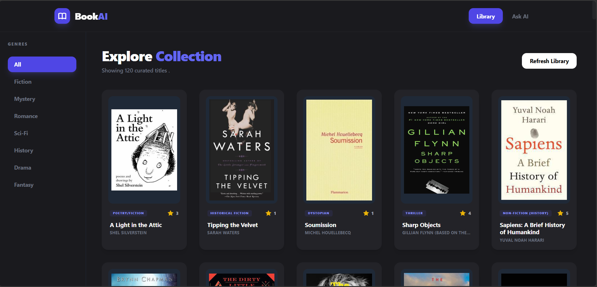
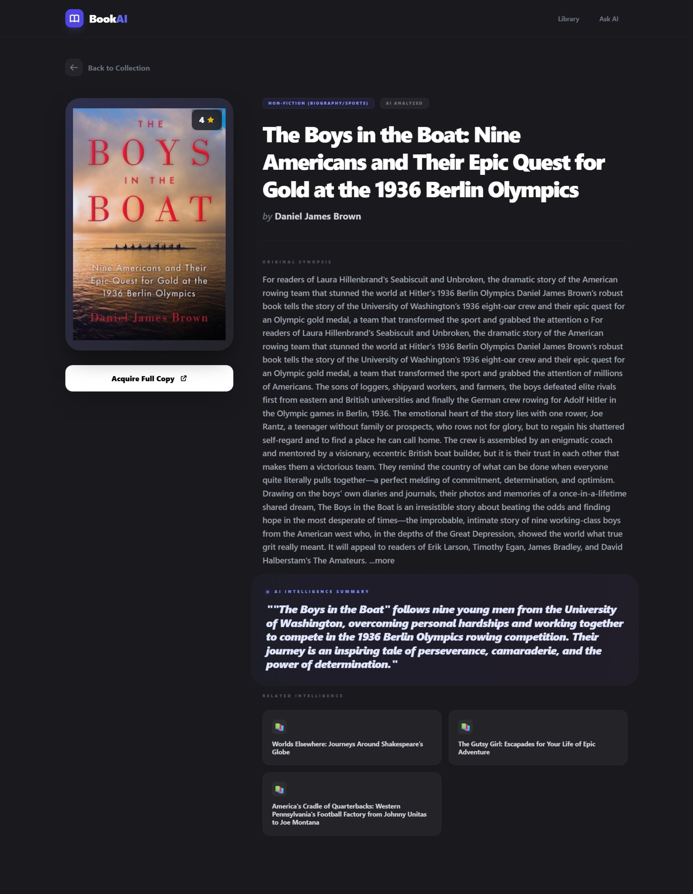
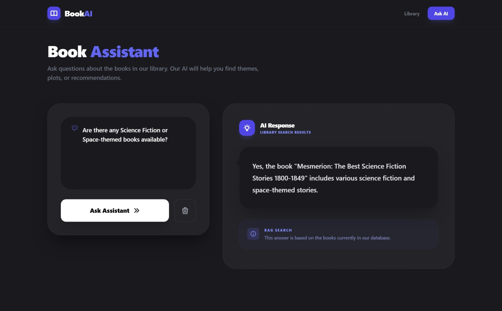
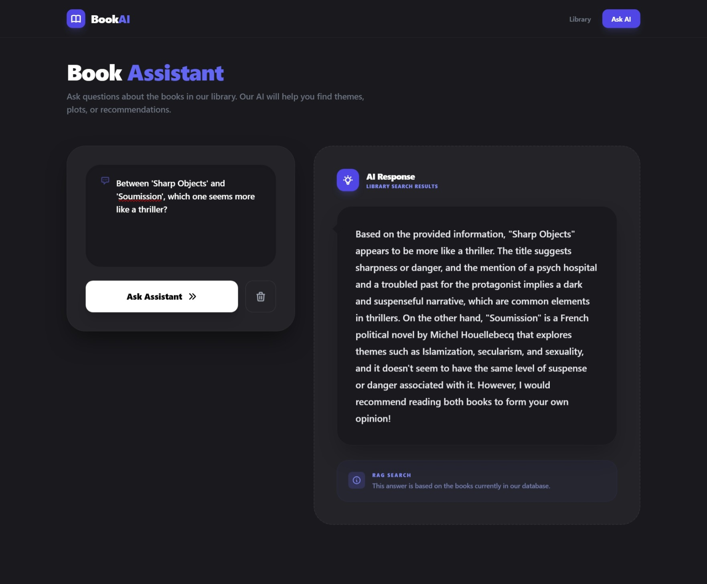
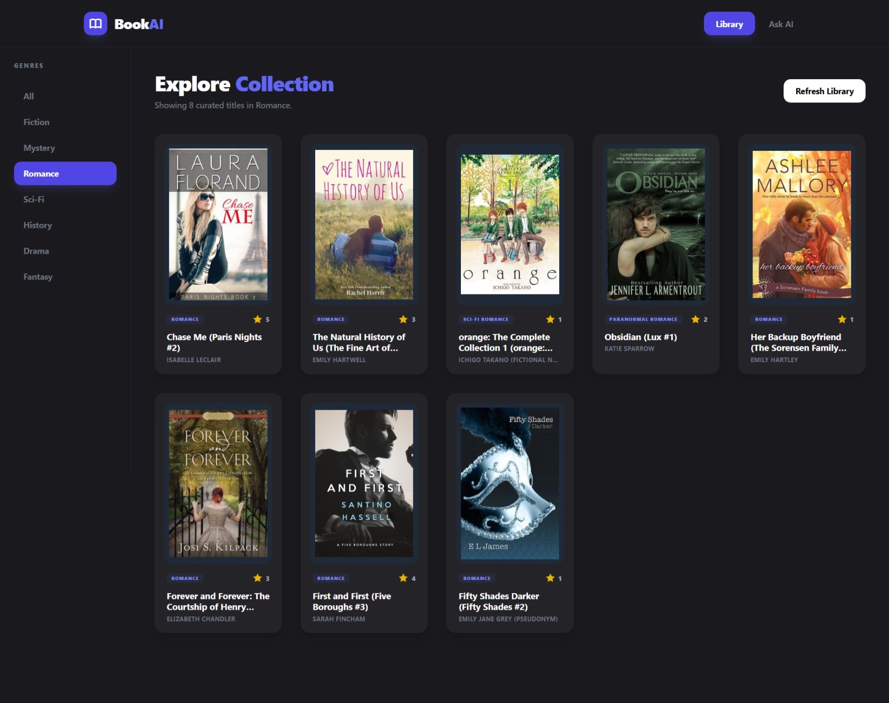

# 📚 BookAI – Intelligent Library Assistant

BookAI is a full-stack application that combines web scraping, vector-based semantic search (RAG), and a modern UI to create an intelligent book querying system.

---

## 🚀 Features

* 📖 Scrapes real book data using Selenium
* 🧠 AI-powered semantic search (RAG)
* 🤖 Local LLM integration via LM Studio
* 🎯 Genre-based filtering
* 📊 Clean and responsive UI (React + Tailwind CSS)
* 🔍 Context-aware question answering

---

## 🛠️ Tech Stack

* **Frontend**: React.js + Tailwind CSS
* **Backend**: Django + Django REST Framework
* **Database**: SQLite
* **AI Engine**: LM Studio (Mistral 7B + Nomic embeddings)
* **Scraping**: Selenium + BeautifulSoup4

---

## 📸 Screenshots

### Dashboard



---

### Book Detail



---

### AI Query (User Question)



---

### AI Query (Response Output)



---

### Genre Filter



---

## ⚙️ Setup Instructions

### 1. Clone Repository

```bash
git clone https://github.com/Riddhi-Patil/book-query-system.git
cd book-query-system
```

---

### 2. Backend Setup

```bash
cd backend
python -m venv venv
venv\Scripts\activate   # Windows
pip install -r requirements.txt
python manage.py migrate
python manage.py runserver
```

---

### 3. Frontend Setup

```bash
cd frontend
npm install
npm start
```

---

### 4. Start AI (LM Studio)

* Open LM Studio
* Load:

  * Mistral 7B (text model)
  * Nomic (embedding model)
* Start local server on port `1234`

---

### 5. Load Book Data

```bash
python manage.py load_library --pages 6
```

---

## 🔗 API Documentation

### GET /books

Fetch all books

---

### GET /books/:id

Fetch details of a specific book

---

### POST /ask

Ask a question to the AI system

#### Request:

```json
{
  "query": "Between 'Sharp Objects' and 'Soumission', which one is more like a thriller?"
}
```

#### Response:

```json
{
  "answer": "Sharp Objects appears to be more aligned with thriller elements..."
}
```

---

## 🧪 Sample Questions & Outputs

1. **Are there any Science Fiction or Space-themed books available?**
2. **Between 'Sharp Objects' and 'Soumission', which one is more like a thriller?**
3. **Suggest books related to love and relationships**
4. **Recommend mystery or suspense books**

---

## 📦 Requirements

All backend dependencies are listed in `requirements.txt`.

---

## 📌 Notes

* Duplicate books are prevented using database-level constraints
* High-resolution images are fetched from individual book pages
* AI responses are generated locally using LM Studio (no API cost)
* RAG pipeline ensures context-aware and relevant answers

---

## 👩‍💻 Author

**Riddhi Bhaskar Patil**
